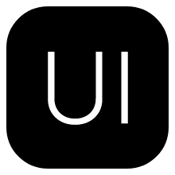

# Portfolio

Welcome to my portfolio! I am Prajwal A K, a passionate and dedicated student with expertise in MERN Stack, Nextjs, DSA in C++. Throughout my career, I have worked on diverse projects, honing my skills in Threejs, Open AI API's .


## Table of Contents

- [Installation](#installation)
- [Features](#features)
- [Contact](#contact)

## Installation

To run this project on your GitHub Codespace, follow these simple steps:

```bash
npm install
```

```bash
npm run dev
```

## Features

### Technologies Used

<div align="center">
  
  
  
  
</div>

## Contact

Feel free to reach out for any collaboration, opportunities, or just to say hello!

- **LinkedIn:** [Prajwal A K](https://www.linkedin.com/in/prajwal-ak-802552191)
- **GitHub:** [Prajwal-ak-0](https://github.com/Prajwal-ak-0)
- **Portfolio Website:** [Your Portfolio Website](https://my-portfolio-nine-chi-51.vercel.app/)

Let's connect and create amazing things together!

